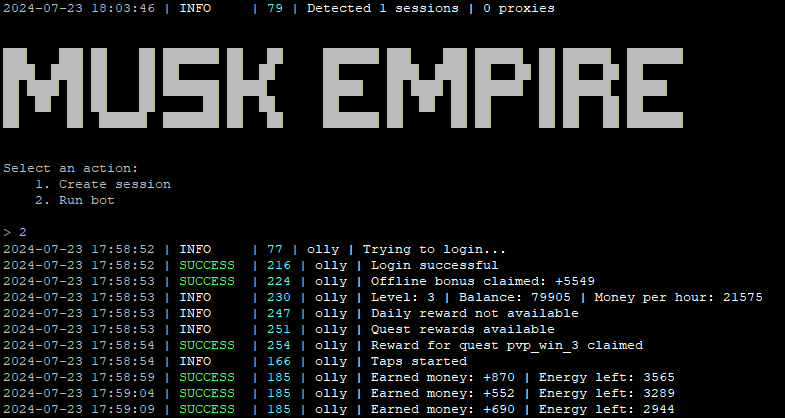

# Bot for [X Empire](https://alexell.pro/cc/xempire) (Musk Empire)



> 🇷🇺 README на русском доступен [здесь](README-RU.md)

## Functionality
| Feature                               | Supported  |
|---------------------------------------|:----------:|
| Multithreading                        |     ✅     |
| Binding a proxy to a session          |     ✅     |
| Sleep before run each session         |     ✅     |
| Claim daily grant                     |     ✅     |
| Claim reward for friends              |     ✅     |
| Claim reward for quests               |     ✅     |
| Claim offline bonus                   |     ✅     |
| Automatic taps                        |     ✅     |
| PvP negotiations                      |     ✅     |
| Daily quiz and rebus solution         |     ✅     |
| Investing in funds (combo for profit) |     ✅     |
| Automatic skill improvement           |     ✅     |
| Docker                                |     ✅     |

## [Options](https://github.com/Alexell/XEmpireBot/blob/main/.env-example)
| Option                  | Description                                                                             |
|-------------------------|-----------------------------------------------------------------------------------------|
| **API_ID / API_HASH**   | Platform data for launching a Telegram session                                          |
| **TAPS_ENABLED**        | Taps enabled (True / False)                                                             |
| **TAPS_PER_SECOND**     | Random number of taps per second (e.g. [20,30], max. 30)                                |
| **PVP_ENABLED**         | PvP negotiations enabled (True / False)                                                 |
| **PVP_LEAGUE**          | League in negotiations (e.g. bronze or auto for automatic selection)                    |
| **PVP_UPGRADE_LEAGUE**  | Upgrade league if league specified in PVP_LEAGUE is unavailable (True / False)          |
| **PVP_STRATEGY**        | Strategy in negotiations (e.g. random)                                                  |
| **PVP_COUNT**           | Number of negotiations per cycle (e.g. 10)                                              |
| **SKILLS_COUNT**        | Number of profit skills improved per cycle (e.g. 10)                                    |
| **SKILLS_MODE**         | Profit skill selection mode for improvement (e.g. profitness)                           |
| **IGNORED_SKILLS**      | Skills that the bot will not improve (e.g. ["agi", "voice_assistant", "translators"])   |
| **MINING_SKILLS_LEVEL** | Max level of mining skill improve (e.g. 10)                                             |
| **PROTECTED_BALANCE**   | Balance protected from spending on PvP, investments and skills (e.g. 100000000)         |
| **SLEEP_BETWEEN_START** | Sleep before start each session (e.g. [20, 360])                                        |
| **ERRORS_BEFORE_STOP**  | The number of failed requests after which the bot will stop                             |
| **USE_PROXY_FROM_FILE** | Whether to use proxy from the `proxies.txt` file (True / False)                         |

You can obtain the **API_ID** and **API_HASH** after creating an application at [my.telegram.org/apps](https://my.telegram.org/apps)

**PvP negotiations** are disabled by default. Enable at your own risk. Upgrade your negotiation and ethics skills to win in case of a tie. League names for the **PVP_LEAGUE** parameter: `bronze`, `silver`, `gold`, `platina`, `diamond`. You can also specify `auto` in the **PVP_LEAGUE** parameter, and the bot will automatically select the lowest available league for you. The default strategy is randomly selected for each negotiation. If you wish, you can specify your own strategy, which will be used **in all** negotiations. Strategy names for the **PVP_STRATEGY** parameter: `aggressive`, `flexible`, `protective`. The **PVP_COUNT** parameter determines the number of negotiations the bot will conduct in one cycle.

The answer to the **daily quiz** and the list of funds with guaranteed profits for **investing** are loaded from a [json file](https://alexell.pro/crypto/x-empire/data.json) on my website. I will try to update the data daily so that all your deployed bots can perform these actions and earn additional profit. When investing, the bet amount will always be the maximum, as the profit is guaranteed. If there is not enough money for the maximum bet, the bet amount will be reduced.

Each cycle, the bot will upgrade as many profit skills as specified in the **SKILLS_COUNT** parameter. The default is 10. You can specify the skill selection mode in the **SKILLS_MODE** parameter. There are 3 modes: `profitness` (the most profitable skills based on the profit/price ratio), `profit` (skills with the highest profit, regardless of price), and `price` (the cheapest skills, regardless of profit). The default mode is `profitness`. If possible, the bot will improve mining skills by 1 level each cycle until the level reaches the value specified in **MINING_SKILLS_LEVEL** parameter. Set it to 0 if you do not need to improve mining skills.

If you want to protect a certain amount of money in the balance, set the desired amount in the **PROTECTED_BALANCE** parameter. The bot will not allow the balance to fall below this amount.

**Intervals.** During the day, if `TAPS_ENABLED=True`, the bot performs taps continuously, with delays only for energy recovery. Other actions are performed approximately every hour. At night, taps and other actions are performed approximately every 3 hours.

## Quick start
### Windows
1. Ensure you have **Python 3.10** or a later version installed.

**Attention:** If you are using **Python 3.12**, before proceeding to the next step, you need to either remove the `TgCrypto` line from `requirements.txt` (TgCrypto is not critical) or install the [required software](https://visualstudio.microsoft.com/visual-cpp-build-tools/) for automatic compilation of this package during installation.

2. Use `INSTALL.bat` to install, then specify your API_ID and API_HASH in the .env file.
3. Use `START.bat` to launch the bot (or in the console: `python main.py`).

### Linux
1. Clone the repository: `git clone https://github.com/Alexell/XEmpireBot.git && cd XEmpireBot`

**Attention:** If you are using **Python 3.12**, before proceeding to the next step, you need to either remove the `TgCrypto` line from `requirements.txt` (TgCrypto is not critical) or install the required software for automatic compilation of this package during installation:
```shell
apt install build-essential python3-dev
```
2. Run the installation: `chmod +x INSTALL.sh START.sh && ./INSTALL.sh`, then specify your API_ID and API_HASH in the .env file.
3. Use `./START.sh` to run the bot (or in the console: `python3 main.py`).

## Running in Docker
```
$ git clone https://github.com/Alexell/XEmpireBot.git
$ cd XEmpireBot
$ cp .env-example .env
$ nano .env # specify your API_ID and API_HASH, the rest can be left as default
```
### Docker Compose (recommended)
```
$ docker-compose run bot -a 1 # first run for authorization (override arguments)
$ docker-compose start # start in background mode (default arguments: -a 2)
```
### Docker
```
$ docker build -t xempire_bot .
$ docker run --name XEmpireBot -v .:/app -it xempire_bot -a 1 # first run for authorization
$ docker rm XEmpireBot # remove container to recreate with default arguments
$ docker run -d --restart unless-stopped --name XEmpireBot -v .:/app xempire_bot # start in background mode (default arguments: -a 2)
```

## Manual installation
You can download [**Repository**](https://github.com/Alexell/XEmpireBot) by cloning it to your system and installing the necessary dependencies:
```
$ git clone https://github.com/Alexell/XEmpireBot.git
$ cd XEmpireBot

# Linux
# ATTENTION: If you have installed Python 3.12, before proceeding to the next step, you need to:
#    either remove the TgCrypto line from requirements.txt (TgCrypto is not critical)
#    or install the necessary software for automatic compilation of this package during installation with the command: apt install build-essential python3-dev
$ python3 -m venv venv
$ source venv/bin/activate
$ pip3 install -r requirements.txt
$ cp .env-example .env
$ nano .env # specify your API_ID and API_HASH, the rest can be left as default
$ python3 main.py

# Windows (first, install Python 3.10 or a later version)
# ATTENTION: If you have installed Python 3.12, before proceeding to the next step, you need to:
#    either remove the TgCrypto line from requirements.txt (TgCrypto is not critical)
#    or install the necessary software for automatic compilation of this package during installation, link: https://visualstudio.microsoft.com/visual-cpp-build-tools/
> python -m venv venv
> venv\Scripts\activate
> pip install -r requirements.txt
> copy .env-example .env
> # specify your API_ID and API_HASH, the rest can be left as default
> python main.py
```

Also for quick launch you can use arguments:
```
$ python3 main.py --action (1/2)
# or
$ python3 main.py -a (1/2)

# 1 - Create session
# 2 - Run bot
```

## Running a bot in the background (Linux)
```
$ cd XEmpireBot

# with logging
$ setsid venv/bin/python3 main.py --action 2 >> app.log 2>&1 &

# without logging
$ setsid venv/bin/python3 main.py --action 2 > /dev/null 2>&1 &

# Now you can close the console, and the bot will continue its work.
```

### Find the bot process
```
$ ps aux | grep "python3 main.py" | grep -v grep
```